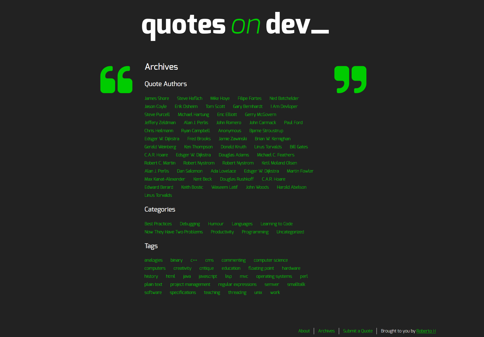

    

## Quotes on Dev 💬

WP-based theme that fetches a random quote on load and accepts quotes submissions. Built with HTML, WordPress, CSS, PHP, vanilla JS & jQuery.

This project is a random quote generator that saves the quotes in the archives back-end and supports personal quotes submissions.

## Installation

### 1. Download me (don't clone me!)

Then add me to your `wp-content/themes` directory.

### 2. Rename the `quotesondev-starter-master` directory

Make sure that the theme directory name is project appropriate!

### 3. Install the dev dependencies

Next you'll need to run `npm install` **inside your theme directory** to install the npm packages you'll need for Gulp, etc.

### 4. Update the proxy in `gulpfile.js`

Lastly, be sure to update your `gulpfile.js` with the appropriate URL for the Browsersync proxy (so change `localhost[:port-here]/[your-dir-name-here]` to the appropriate localhost URL).

And now would be a good time to `git init` :)
---
### Technologies Used

* VS Code
* Wordpress
* HTML
* SASS
* PHP
* JavaScript
* Gulp
* jQuery

## Project Comps
### Front Page

### Submit a Quote

### Quotes Archives

This project was created with 💙 by <a href="https://github.com/robhhr">Roberto H.</a>